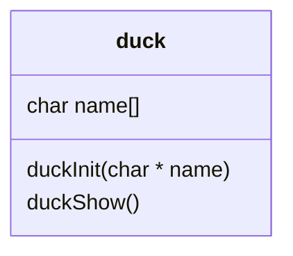
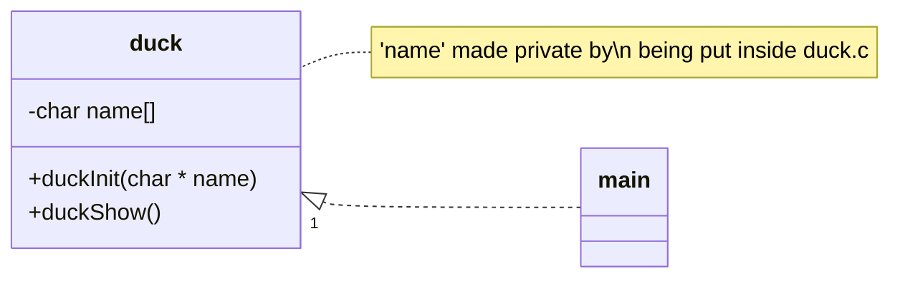
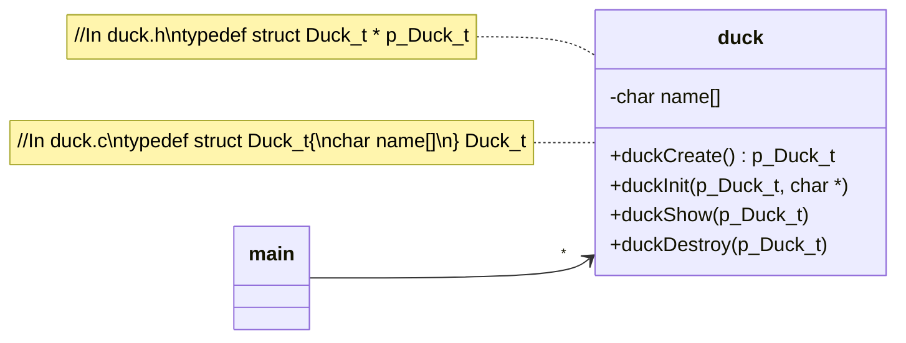
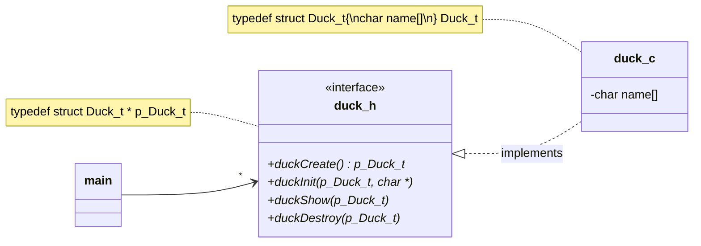
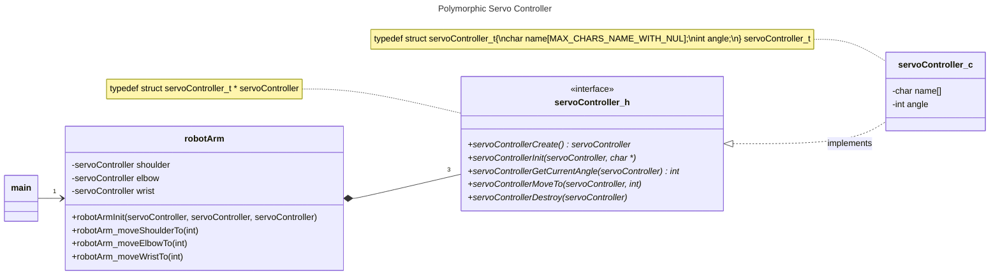
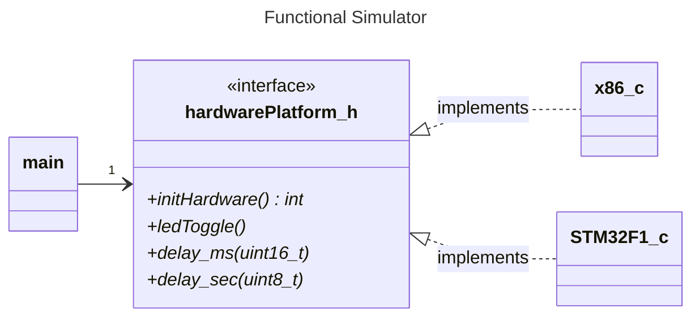
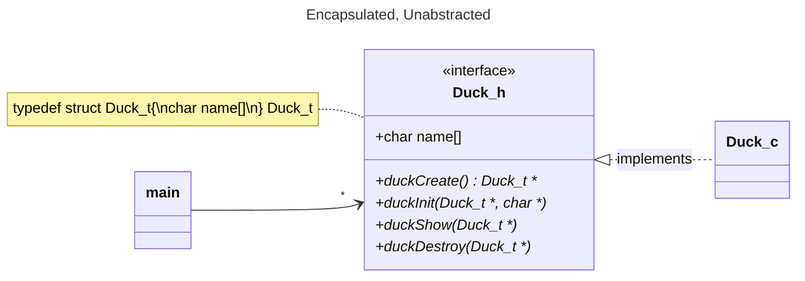
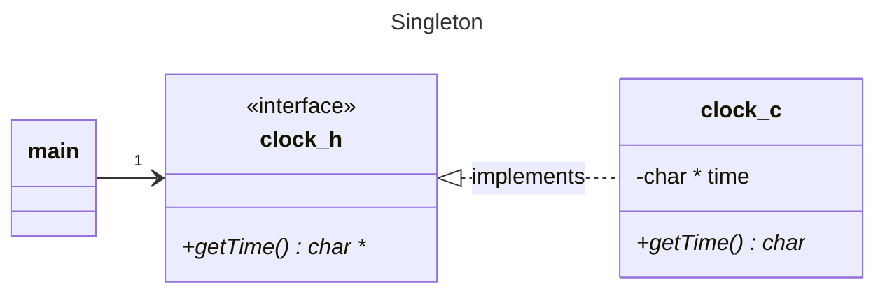

```mermaid
%% Diagram to show the kinds of things we want to
%% do with ducks.
classDiagram
    class duck{
        char name[]
        duckInit( char * name)
        duckShow()
    }
```

```mermaid
%% Singleton
classDiagram
    direction RL
    main ..|> "1" duck
    note for duck "'name' made private by\n being put inside duck.c"
    class duck{
        -char name[]
        +duckInit( char * name)
        +duckShow()
    }
```

```mermaid
%% Opaque structs
classDiagram
    direction LR
    main --> "*" duck
    note for duck "//In duck.h\ntypedef struct Duck_t * p_Duck_t"
    note for duck "//In duck.c\ntypedef struct Duck_t{\nchar name[]\n} Duck_t"
    class duck{
        -char name[]
        +duckCreate() p_Duck_t
        +duckInit(p_Duck_t, char *)
        +duckShow(p_Duck_t)
        +duckDestroy(p_Duck_t)
    }
```

```mermaid
%% Headers as interface classes
classDiagram
    direction LR
    main --> "*" duck_h
    duck_h <|.. duck_c : implements
    note for duck_h "typedef struct Duck_t * p_Duck_t"
    note for duck_c "typedef struct Duck_t{\nchar name[]\n} Duck_t"
    <<interface>> duck_h
    class duck_h{
        +duckCreate()* p_Duck_t
        +duckInit(p_Duck_t, char *)*
        +duckShow(p_Duck_t)*
        +duckDestroy(p_Duck_t)*
    }
    class duck_c{
        -char name[]     
    }
```

```mermaid
---
title: Polymorphic Servo Controller
---
classDiagram
    direction LR
    main --> "1" robotArm
    robotArm *-- "3" servoController_h
    class robotArm{
        -servoController shoulder
        -servoController elbow
        -servoController wrist 
        +robotArmInit(servoController, servoController, servoController)
        +robotArm_moveShoulderTo(int)
        +robotArm_moveElbowTo(int)
        +robotArm_moveWristTo(int)
    }
    
    servoController_h <|.. servoController_c : implements
    note for servoController_h "typedef struct servoController_t * servoController"
    note for servoController_c "typedef struct servoController_t{\nchar name[MAX_CHARS_NAME_WITH_NUL];\nint angle;\n} servoController_t"
    <<interface>> servoController_h
    class servoController_h{
        +servoControllerCreate()* servoController
        +servoControllerInit(servoController, char *)*
        +servoControllerGetCurrentAngle(servoController)* int
        +servoControllerMoveTo(servoController, int)*
        +servoControllerDestroy(servoController)*
    }
    class servoController_c{
        -char name[]    
        -int angle 
    }
```

```mermaid
---
title: Functional Simulator
---
classDiagram
    direction LR
    main --> "1" hardwarePlatform_h    
    hardwarePlatform_h <|.. x86_c : implements
    hardwarePlatform_h <|.. STM32F1_c : implements
    <<interface>> hardwarePlatform_h
    class hardwarePlatform_h{
        +initHardware()* int
        +ledToggle()*
        +delay_ms(uint16_t)*
        +delay_sec(uint8_t)*
    }
```

---------------------------------------------------------------------

```mermaid
---
title: Encapsulated, Unabstracted
---
classDiagram
    direction LR
    main --> "*" Duck_h
    Duck_h <|.. Duck_c : implements
    note for Duck_h "typedef struct Duck_t{\nchar name[]\n} Duck_t"
    <<interface>> Duck_h
    class Duck_h{
        +char name[]
        +duckCreate()* Duck_t *
        +duckInit(Duck_t *, char *)*
        +duckShow(Duck_t *)*
        +duckDestroy(Duck_t *)*
    }
```

```mermaid
---
title: Singleton
---
classDiagram
    direction LR
    main --> "1" clock_h
    clock_h <|.. clock_c : implements
    clock_h: +getTime()* char *
    <<interface>> clock_h
    class clock_c{
        -char * time
        +getTime() char *
    }
```